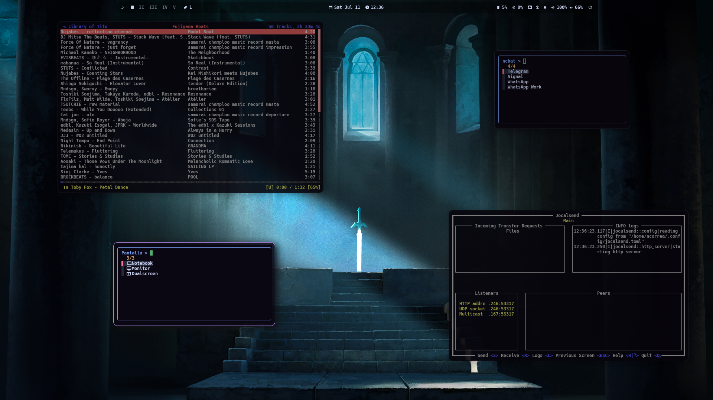
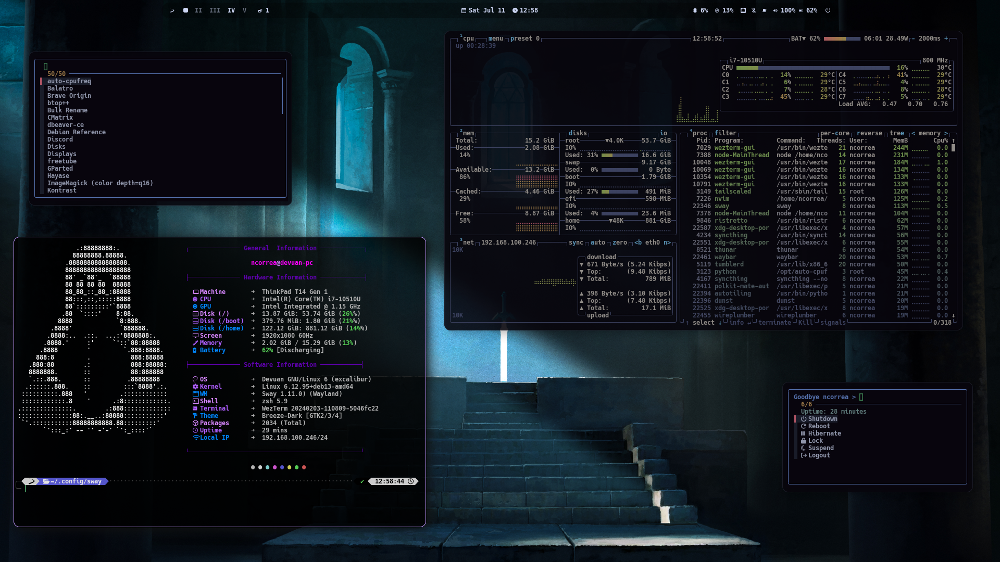
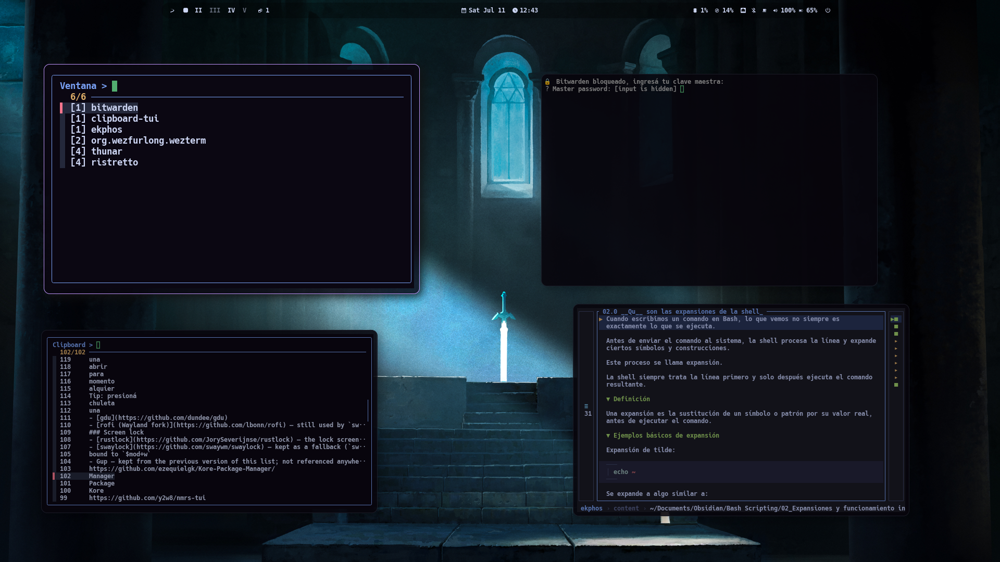
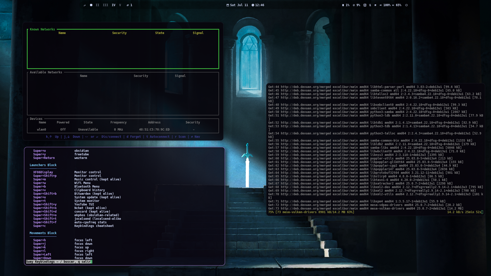
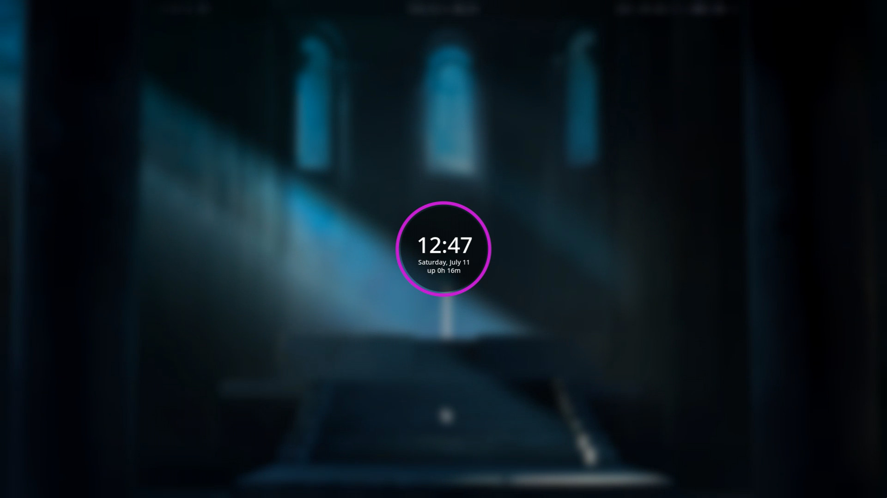

<div align="center">

# dotfiles

**Personal Linux config for a Devuan + OpenRC + Sway workstation**

[](LICENSE)
[](https://www.zsh.org)
[](https://swaywm.org)
[](https://www.lazyvim.org)

</div>

---

Collection of dotfiles for a Wayland/Sway session on Devuan with OpenRC. Symlinked straight into `$HOME` and `$HOME/.config` by `scripts/install.sh` on a fresh machine. There was a previous Xorg + i3 setup; it's archived and deprecated in `archive/`.

_[Leer en español](README.es.md)_

## Stack

| Layer | Tech |
| --- | --- |
| Init system | OpenRC (Devuan) |
| Compositor / WM | Sway (Wayland) |
| Shell | Zsh |
| Terminal | WezTerm |
| Editor | Neovim + LazyVim |
| Multiplexer | Zellij |
| File manager | Yazi (archived: vifm) |
| Bar / notifications | Waybar, dunst |
| Package fetch | eget (`.eget.toml`) |
| Lock screen | rustlock-script |

## Quick Start

```bash
git clone git@github.com:ncorrea-13/dotfiles.git ~/dotfiles
cd ~/dotfiles
./scripts/install.sh        # prompts before symlinking, backs up existing files
# or skip the prompt:
./scripts/install.sh -y
```

`install.sh` symlinks every dir under `.config/` plus `.zshrc`, `.alias`, `.eget.toml`, `.start-sway.sh` into `$HOME` (existing files get moved to `*.bak-<timestamp>`). It only wires up config, install the actual programs first, see [docs/PERSONALPROGRAMS.md](docs/PERSONALPROGRAMS.md). Restart the session after.

## Project Structure

```
.config/          # symlink targets: sway, nvim, wezterm, zellij, waybar, dunst, btop, ...
scripts/
├── install.sh          # symlinks configs into $HOME
├── dotfiles.sh          # repo helper
├── appimage-manager     # manages personal AppImage programs
├── bw-update             # Bitwarden CLI update helper
├── discordDownloader
└── rustlock-script
docs/              # KEYBINDINGS, SCRIPTS, PERSONALPROGRAMS (+ .es variants)
archive/           # deprecated Xorg/i3 setup, kept for reference
screenshots/        # Devuan desktop screenshots
.zshrc, .alias, .eget.toml, .start-sway.sh   # dotfiles symlinked to $HOME root
```

## Documentation

| Document | Content |
| --- | --- |
| [docs/KEYBINDINGS.md](docs/KEYBINDINGS.md) | Every keybinding and every Zsh alias/function |
| [docs/SCRIPTS.md](docs/SCRIPTS.md) | What each script in `.config/sway/scripts/` and `scripts/` does |
| [docs/PERSONALPROGRAMS.md](docs/PERSONALPROGRAMS.md) | Personal programs needed for a fresh install |

## Screenshots







## License

- **Configs:** [MIT License](https://opensource.org/licenses/MIT)
- **LazyVim:** [Apache License 2.0](https://www.apache.org/licenses/LICENSE-2.0.html)

Comply with both when using or redistributing this repo. Full text in [LICENSE](LICENSE).

---

_Mendoza, Argentina - Nicolás Correa ([ncorrea-13](https://github.com/ncorrea-13))_
